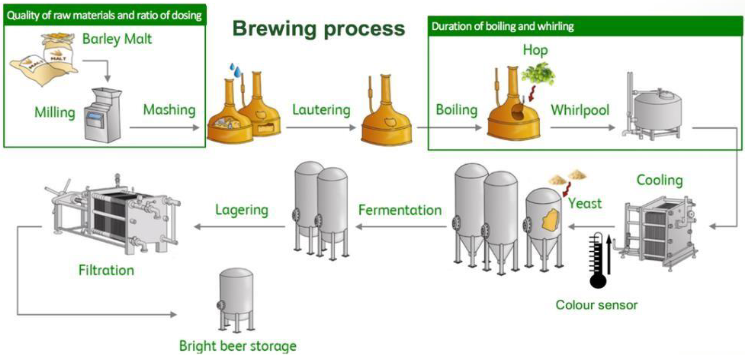

# 🍺 Heineken Data Science Use Case 2024

O desafio é explorar o conjunto de dados e utilizar técnicas de ciência de dados para identificar padrões ou características que possam contribuir para a correção do índice de cor da cerveja, focando na marca AMSTEL e prestando atenção especial à fase imediatamente posterior ao processo de resfriamento. Com base nos dados disponíveis, ajustar um modelo para prever a cor do mosto frio apenas para a marca AMSTEL.

Confira o código da solução no arquivo: [main.ipynb](main.ipynb)

Confira a apresentação deste case: [apresentação no canva](https://www.canva.com/design/DAF6X03yKjk/T-H9tcz5mCuqDqAlMrVyCg/edit?utm_content=DAF6X03yKjk&utm_campaign=designshare&utm_medium=link2&utm_source=sharebutton)

## 📄 Descrição do processo de fabricação

O processo de fermentação tem duas fases principais, uma fase quente e uma fase fria (Figura 1). Na fase quente são moídos dois tipos de maltes: um malte base, de cor clara e presente em maior quantidade, e um malte torrado, de cor mais escura e por isso utilizado para dar à cerveja a cor desejada.

Esses maltes são enviados para o malteador e cozidos com água na etapa de mosturação. Os grãos são então filtrados na etapa de lavagem, após a qual o mosto (líquido extraído da mosturação) é fervido com lúpulo. O lúpulo usado é então filtrado no redemoinho e o mosto quente segue para esfriar para ser posteriormente fermentado. Cada produção que passa por essas fases é chamada de “lote”.

Vários KPIs são monitorados ao longo deste processo. Um fator importante que caracteriza as marcas de cerveja é a cor.
Como é conhecimento empírico da fabricação de cerveja que a fase quente da cerveja é o que mais afeta a cor final da cerveja

<b>Figura 1:</b> Diagrama do processo de fabricação de cerveja

## 🔎 Descrição de colunas do dataset

Colunas do [dataset](./dataset.csv)

1. **Job ID:** Identificador único de cada lote
2. **Date/Time:** Data e hora em que o processo em lote foi iniciado
3. **Roast amount (kg):** Quantidade de malte torrado utilizado
4. **1st (base) malt amount (kg):** Quantidade de malte base 1 usada
5. **2nd (base) malt amount (kg):** Quantidade de malte de 2ª base usada (* os maltes de 1º e 2º são misturados durante a moagem, mas podem vir de lotes diferentes)
6. **MT – Temperature (ºC):** Temperatura agregada do fogão de malte
7. **MT – Time (s):** Período de tempo que o lote permaneceu na panela de malte
8. **WK – Temperature (°C):** Temperatura agregada do fogão de mosto
9. **WK – Steam:** Quantidade de vapor agregado da panela de mosto
10. **WK – Time (s):** Período de tempo que o lote permaneceu na panela de mosto
11. **Total cold wort (HL):** Volume total do lote de mosto frio após resfriamento
12. **pH:** O pH agregado de um lote medido durante o resfriamento
13. **Extract (ºP):** Extrato agregado de um lote medido durante o resfriamento (mede a concentração de açúcares no mosto)
14. **Color (EBC) (Model Target):** Valor de cor gerado por um sensor (medido nas Convenções Europeias de Cervejaria)
15. **WOC – Time (s):** Período de tempo que o lote permaneceu no Wort Cooler
16. **WHP Transfer – Time (s):** Tempo de transferência da Whirlpool
17. **WHP Rest – Time (s):** Tempo de descanso da hidromassagem
18. **Roast color (EBC):** Cor do malte torrado
19. **1st malt color (EBC):** Cor do 1º malte
20. **2nd malt color (EBC):** Cor do 2º malte
21. **Product:** Produto especificado de um lote
    - Heineken (HNK)
    - Amstel (AMST)